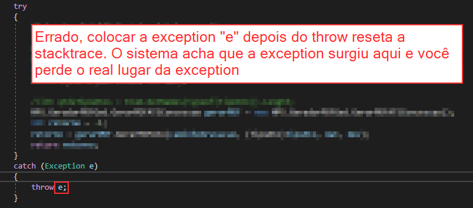
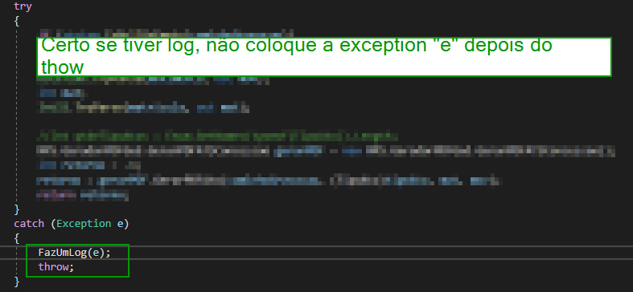
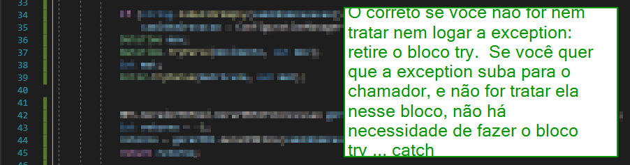
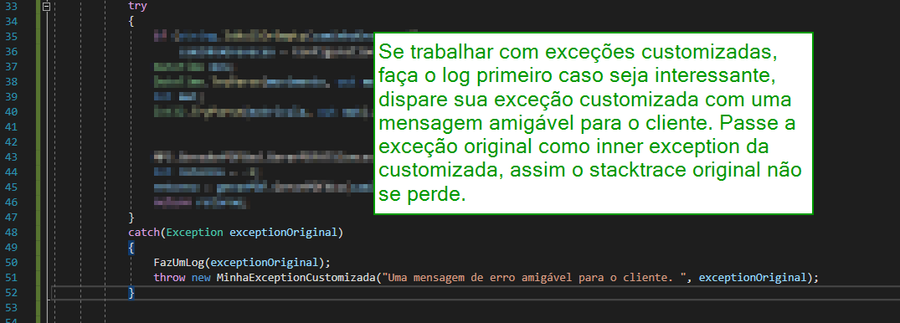

# Tutorial de Tratamento de Exceptions no C#
Exemplos de Manipulação e tratamento de Exceções em C# - Examples of Exception Handling in C#

## Uso correto do try ... catch

Use um bloco try ... catch apenas se você quiser tratar ou logar a exception nesse local e puder se recuperar dela. Se precisar continuar subindo a exception na stack para ela ser relançada na camada acima (chamador) nunca faça &quot;throw e&quot;. Isso reseta a stacktrace e faz a exception ocorrer na linha que você deu o throw em vez de na linha que realmente aconteceu a exception.

O exemplo abaixo está errado.

Se você for logar a exception mas ainda assim precisa que ela suba para as camadas acima (chamador) porque quer que ela siga o fluxo normal, então chame um método para logar a exception e depois chame throw, mas não throw e. O motivo já foi explicado acima.

O bloco abaixo está correto. Ele loga a exception, mas não deixa o programa continuar, relança a mesma exception sem resetá-la simplesmente com throw.

Se você não for nem tratar o erro nem logar a exception, não há necessidade de um try ... catch: deixe o código que geraria a exception sem o bloco try ... catch porque se uma ocorrer o chamador trata, se o chamador não tratar, a página de erro global ou handler global de erros vai pegar. Nesse caso o erro pode ir para a tela, mas uma mensagem de erro mais amigável pode ser criada.

Se você desejar lançar uma exception customizada com uma mensagem amigável para o cliente não esqueça de fazer duas coisas:

1. Logar a exception
2. Passar a exception original como inner exception para que o local exato onde o erro foi gerado não seja perdido. Isso acelera nossa velocidade de debug.

## Tipos de Exceptions

Para exceções das suas regras de negócio é interessante você criar tipos de exceptions customizadas para sua aplicação.

No entanto o .net vem com alguns tipos de Exceções que você pode usar, mas tem outras que são reservadas de sistema e você não deve usar.

Use:

- ArgumentException
- ArgumentNullException
- ArgumentOutOfRangeException
- InvalidOperationException

Não dispare nem derive de:

- Exception
- SystemException

Evite também interceptar essas exceptions se não for relançá-las.

Não dispare nem derive:

- ApplicationException

Não dispare:

- NullReferenceException
- IndexOutOfRangeException
- AccessViolationException

Não dispare:

- OutOfMemoryException

Não dispare nem tente interceptar:

- StackOverflowException

Não dispare:

- ComException
- SEHException
- ExecutionEngineException

---

### Exemplos: 
- [TutorialExceptions](./TutorialExceptions/)

Repositório no github: [https://github.com/vitorrubio/CSharpExceptionHandlingExample](https://github.com/vitorrubio/CSharpExceptionHandlingExample)

---
### Fontes:

[https://docs.microsoft.com/en-us/dotnet/standard/exceptions/how-to-use-the-try-catch-block-to-catch-exceptions#:~:text=Place%20any%20code%20statements%20that,to%20handle%20that%20exception%20type](https://docs.microsoft.com/en-us/dotnet/standard/exceptions/how-to-use-the-try-catch-block-to-catch-exceptions#:~:text=Place%20any%20code%20statements%20that,to%20handle%20that%20exception%20type).

[https://docs.microsoft.com/en-us/dotnet/csharp/language-reference/keywords/try-catch](https://docs.microsoft.com/en-us/dotnet/csharp/language-reference/keywords/try-catch)

[https://stackoverflow.com/questions/15297065/how-to-correctly-use-try-catch-statement](https://stackoverflow.com/questions/15297065/how-to-correctly-use-try-catch-statement)

[https://kumarashwinhubert.com/exception-handling-in-csharp-throw-or-throw-ex](https://kumarashwinhubert.com/exception-handling-in-csharp-throw-or-throw-ex)

[https://exceptionnotfound.net/csharp-in-simple-terms-12-exceptions-and-exception-handling/](https://exceptionnotfound.net/csharp-in-simple-terms-12-exceptions-and-exception-handling/)

[https://www.tutorialsteacher.com/csharp/csharp-exception](https://www.tutorialsteacher.com/csharp/csharp-exception)

[https://docs.microsoft.com/en-us/dotnet/standard/design-guidelines/using-standard-exception-types](https://docs.microsoft.com/en-us/dotnet/standard/design-guidelines/using-standard-exception-types)

[https://www.tutorialspoint.com/Built-in-Exceptions-in-Chash](https://www.tutorialspoint.com/Built-in-Exceptions-in-Chash)

[https://www.c-sharpcorner.com/article/exception-handling-in-C-Sharp/](https://www.c-sharpcorner.com/article/exception-handling-in-C-Sharp/)

[https://docs.microsoft.com/pt-br/previous-versions/visualstudio/visual-studio-2015/code-quality/ca2201-do-not-raise-reserved-exception-types?view=vs-2015&redirectedfrom=MSDN](https://docs.microsoft.com/pt-br/previous-versions/visualstudio/visual-studio-2015/code-quality/ca2201-do-not-raise-reserved-exception-types?view=vs-2015&redirectedfrom=MSDN)

[https://docs.microsoft.com/en-us/dotnet/standard/exceptions/how-to-create-localized-exception-messages](https://docs.microsoft.com/en-us/dotnet/standard/exceptions/how-to-create-localized-exception-messages)